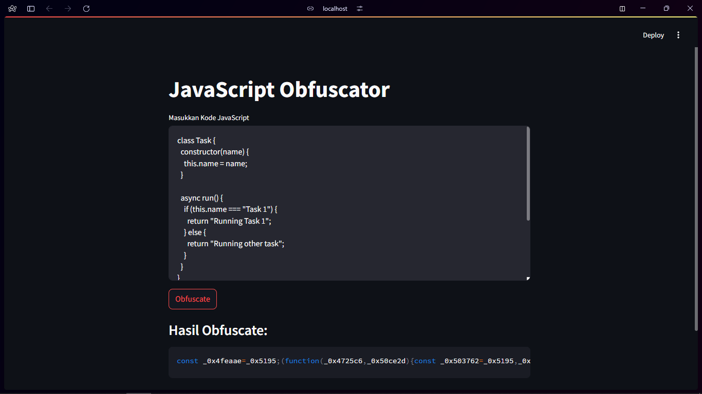

# JavaScript Obfuscator dengan Python dan Streamlit

Proyek ini adalah alat obfuscator JavaScript sederhana yang dibangun menggunakan Python. Alat ini memungkinkan pengguna untuk meng-obfuscate kode JavaScript dengan berbagai teknik untuk membuat kode lebih sulit dipahami dan dibalikkan. Antarmuka pengguna didukung oleh Streamlit, yang menyediakan aplikasi web sederhana dan interaktif bagi pengguna untuk mengunggah kode JavaScript mereka dan meng-obfuscate-nya.

## Fitur
- Mendukung obfuscation pada fungsi JavaScript, termasuk metode `async/await`.
- Antarmuka berbasis web yang dibangun dengan Streamlit untuk pengalaman yang mudah dan interaktif.
- Proses obfuscation dilakukan menggunakan teknik berbasis Python untuk kode JavaScript.

## Prasyarat

Sebelum menjalankan proyek ini, pastikan Anda telah menginstal hal-hal berikut:

- Python 3.x
- pip (penyedia paket Python)
- Node.js dan npm (untuk menjalankan dependensi JavaScript)

Selain itu, Anda disarankan untuk membuat lingkungan virtual untuk menghindari konflik dengan proyek lain.

## Instalasi

### Langkah 1: Kloning Repositori

Kloning repositori ini ke mesin lokal Anda menggunakan perintah berikut:

```bash
git clone https://github.com/AchmadMuafiTaufiqurrochman/js-obfuscator.git
cd js-obfuscator
```

### Langkah 2: Install dependency 

Install semua library dan dependency yang dibutuhkan project ini dengan
```bash
npm install
pip install -r requirements.txt
```
### Langkah 3: Jalankan Program ini

Jalankan program ini di linux dengan command :

```bash
streamlit run app.py
```
Maka akan terbuka di browser dengan url 

```bash 
http://localhost:8501
```
Inilah UI Aplikasi Obfuscator JavaScript yang dibuat dengan library Streamlit.

